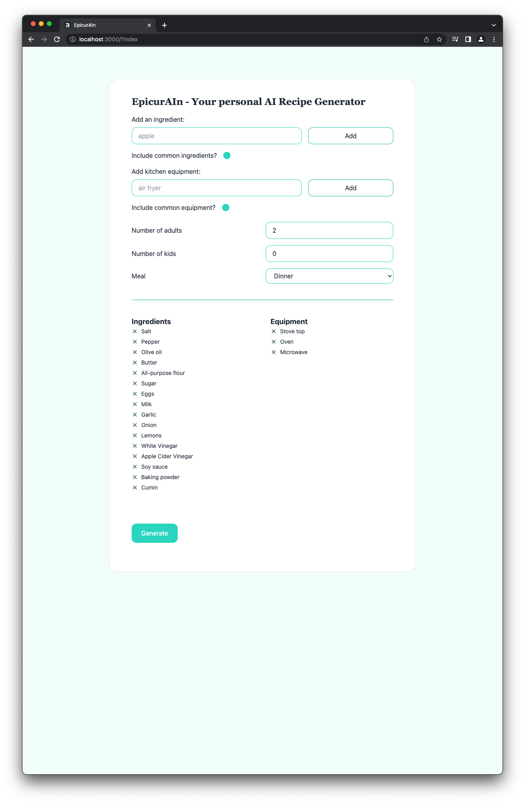

# EpicurAIn - Your personal AI Recipe Generator

Simple one-page application that uses chatGPT to generate recipes based on provided ingredients and equipment. 

Built on the Remix [Indie Stacks](https://github.com/remix-run/indie-stack) but with many included features ignored.

To avoid GPT API charges, this is not deployed anywhere.

